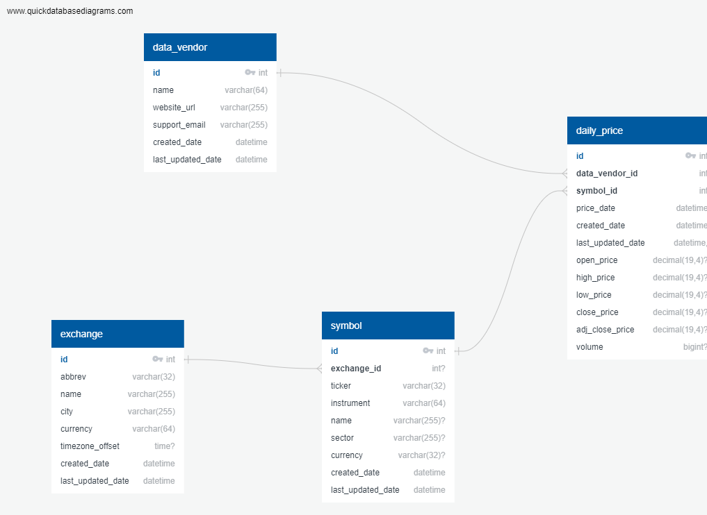
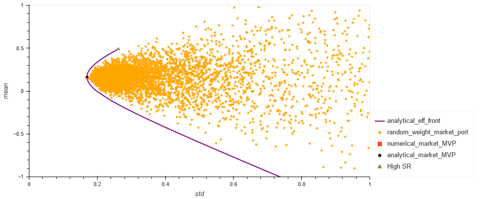
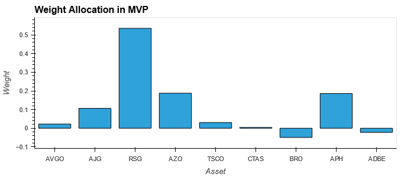
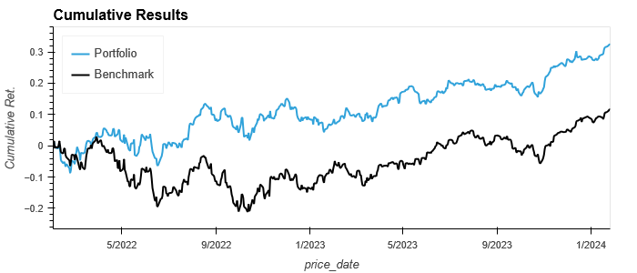
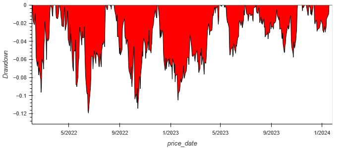
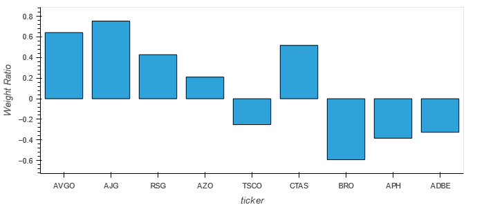
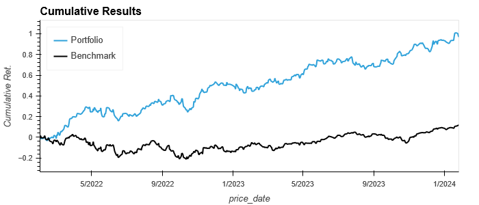
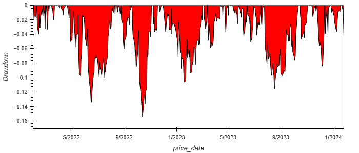
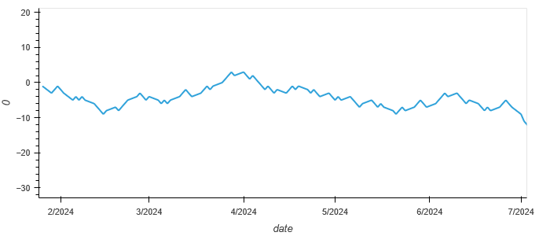

# Investment Portfolio Strategy Using Machine Learning Techniques

## Project Description
This is a portfolio building strategy that combines machine learning to predict stock price up/down movements. It employs features engineering statistics and portfolio management strategies. Its main features include:

* A PostgreSQL database where stock data for a vast number of equities are stored
* Features engineering and data transtormation through the application of Principal Component Analysis (PCA)
* A search for tradeable stocks from the database 
* An investment strategy selecting stocks that exhibit a negative skew in their log-normal return distributions and positive high Sortino ratios 
* Portfolio asset allocation and risk management following the CAPM framework, as well as the mean-variance-skewness-kurtosis and VaR criteria
* Also included, a tool created to predict up/down price movements using the following machine learning algorithms:
  * SVR (Support Vector Regressor)
  * LDA (Linear Discriminant Analysis) 
  * QDA (Quadratic Discriminant Analysis)

## Data Import & Storage
The list of all S&P500 tickers is obtained and downloaded to the the Symbol table using the ticker_fetch.ipynb. It uses bs4.BeautifulSoup(response.text) to convert table into text.
 
Notebook price_import_to_db.ipynb imports daily prices for the last 20 years for all 503 tickers to the database via financialmodelingprep API.

All data was then accessible from the securities_master, which was created in PostgreSQL using the schema shown below:

## Asset Selection
For the strategy, only assets with the following characteristics will be selected:

* The log-normal adjusted returns distribution exhibit a negative (right) skew
* High Sortino Ratios

## Asset Allocation
The minimum variance portfolio (MVP) and efficient frontier are evaluated for the assets selected in three different ways:
* Random asset alocation algorithm
* Analytical solution to Markowitz Portfolio Theory
* Numerical optimization of all feasible portfolios according to Markowitz Portfolio Theory

### Portfolio Management - Backtest Results
### Optimal Return-to-risk weight allocation:

### Optimal Return-to-risk Equity Curve:

### Optimal Return-to-risk Drawdown:

### High Sortino Ratio weight allocation:

### High Sortino Ratio Equity Curve:

### High Sortino Ratio Drawdown:

## Forecasting Trade Tool
The tool works as follows:

1.  Fits a forecasting model to a data subset of the assest above (training set).
 
    * The features_engineering function is used to generate moving averages to be used as features along with volume for a principal component analysis (PCA) to reduce input variables.

    * Several regression models are used individually to observe their individual goodness of fit through r2

2.  Uses simple moving average [5,10,20,60] of adjusted closing returns data as a predictor for tomorrow’s returns. 
    * If the returns are predicted as positive then = 1 
    * If the returns are predicted as negative then = -1

### Up/Down Forecast for ADBE 

