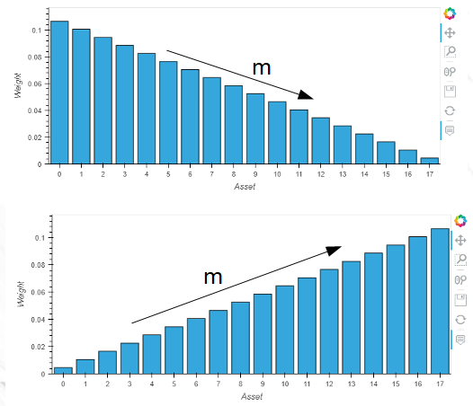

# Investment Portfolio Strategy Using Machine Learning Techniques

## Project Description
This is a portfolio building strategy that combines machine learning to create predictive learning algorithms, features engineering statistics, and portfolio management strategies in order to beat the market benchmark S&P 500 (^GSPC). Its main features include:

* A PostgreSQL database where stock data for a vast number of equities are stored
* Features engineering and data transtormation through the application of Principal Component Analysis (PCA)
* A search for tradeable stocks from the database based on the Sharpe, Sortino, and other criteria
* A trading strategy created using the following machine learning algorithms:
  * SVR (Support Vector Regressor)
  * LDA (Linear Discriminant Analysis) 
  * QDA (Quadratic Discriminant Analysis)
* The use of ensemble methods to select the most profitable stocks
* Portfolio Risk Management employing the mean-variance-skewness-kurtosis criterion

## Data Import & Storage
The list of all S&P500 tickers is obtained and downloaded to the the Symbol table using the ticker_fetch.ipynb. It uses bs4.BeautifulSoup(response.text) to convert table into text.
 
Notebook price_import_to_db.ipynb imports daily prices for the last 3 years for all 503 tickers to the database via financialmodelingprep API.

All data was then accessible from the securities_master, which was created in PostgreSQL using the schema shown below:

## Asset Selection
For the strategy, only assets with the following characteristics will be selected:

* The adjusted returns exhibit a standard deviation less than the median value for all assets
* The skewness and kurtosis of the adjusted returns distributions are as close as possible to those of a normal distribution (i.e, skewness close to 0, and kurtosis close to 3)

## Forecasting Trade
The strategy is as follows:

1.  Fit a forecasting model to a data subset of the assest above (training set).
 
    * The features_engineering function is used to generate moving averages to be used as features along with volume for a principal component analysis (PCA) to reduce input variables.

    * Several regression models are used individually to observe their individual goodness of fit through the use of r2

    * An ensemble model is used to combine the best model results

2.  Use simple moving average [5,10,20,60] of adjusted closing returns data as a predictor for tomorrow’s returns. 
    * If the returns are predicted as positive then go long. 
    * If the returns are predicted as negative then exit.

### Regression Model Results -- Selecting Only Positive

### Strategy Forecast - Equity curves and Returns Distribution

## Portfolio Management - Weights Allocation Algorithm
Before running a backtest on the strategy, various asset weight regimes are developed through a linear change in weights. The code  iterates through multiple possibilities of slope "m" which making sure the total sum of weights equals 1.

## Portfolio Management - Backtest Results
### Optimal allocation:

### Equity Curve:

### Risk Contribution:

